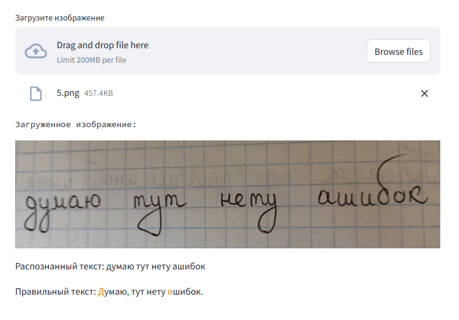

# Сервис для автоматической проверки орфографии

Веб-приложение для проверки ошибок на фотографии

# Модели

Модель для распознавания текста  
**[raxtemur/trocr-base-ru](https://huggingface.co/raxtemur/trocr-base-ru)**

Модель для исправления опечаток, пунктуационных и орфографических ошибок  
**[ai-forever/sage-fredt5-distilled-95m](https://huggingface.co/ai-forever/sage-fredt5-distilled-95m)**

# Использование

```
# Загрузка проекта и установка необходимых библиотек
git clone https://github.com/OlegGubanov/software-engineering-2.git
pip install -r requirements.txt

# Запуск Streamlit-приложения
streamlit run main.py
```

# Пример использования приложения



# Демо

Вы можете попробовать приложение по ссылке:  
https://software-engineering-2.streamlit.app/
